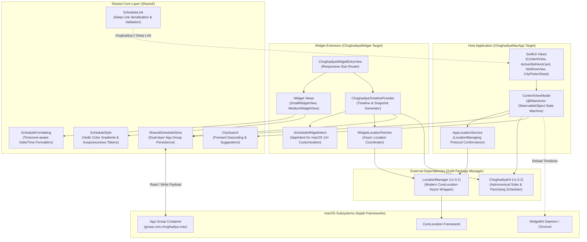
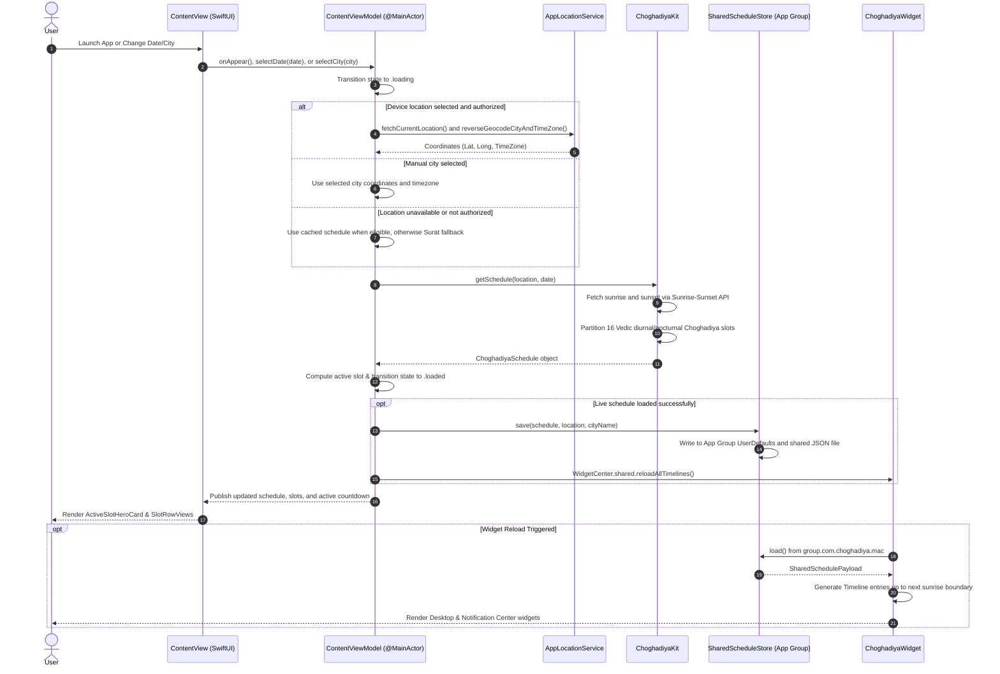

# Choghadiya for Mac Architecture Blueprint

This document provides a comprehensive technical blueprint of **Choghadiya for Mac**, outlining its system design, unidirectional data flow, concurrency model, App Group IPC architecture, WidgetKit extension lifecycle, and deterministic testing philosophy.

---

## Table of Contents

- [Architectural Principles](#architectural-principles)
- [High-Level System Architecture](#high-level-system-architecture)
- [End-to-End Data Flow Sequence](#end-to-end-data-flow-sequence)
- [Core Layers & Responsibilities](#core-layers--responsibilities)
  - [1. Presentation Layer (MVVM)](#1-presentation-layer-mvvm)
  - [2. Services & Abstraction Layer](#2-services--abstraction-layer)
  - [3. Astronomical Calculation Engine](#3-astronomical-calculation-engine)
  - [4. Shared Storage & IPC Layer](#4-shared-storage--ipc-layer)
  - [5. WidgetKit Extension Architecture](#5-widgetkit-extension-architecture)
- [Concurrency & Thread Safety](#concurrency--thread-safety)
- [Inter-Process Communication & App Group Persistence](#inter-process-communication--app-group-persistence)
- [Widget Deep Linking Specification](#widget-deep-linking-specification)
- [Testing Architecture & Deterministic Doubles](#testing-architecture--deterministic-doubles)

---

## Architectural Principles

1. **Astronomical Fidelity:** Solar timings are non-linear; time divisions are strictly derived from true astronomical local sunrise and sunset calculations rather than fixed clock approximations.
2. **Concurrency & `@MainActor` Boundaries:** UI state management is isolated to the main actor. Location, network, and solar operations use asynchronous APIs; the app targets currently compile in Swift 5 language mode.
3. **Race Condition Handling:** Rapid user interactions cancel obsolete in-flight tasks and use unique request identifiers to prevent older results from replacing newer state.
4. **App Group IPC Resilience:** Synchronization between the host app and the widget extension relies on a dual-layer persistence strategy (`UserDefaults` with App Group suite + fallback JSON file in the shared container).
5. **Deterministic Testability:** Tests inject time (`TestClock`), location (`LocationManaging`), solar calculations (`SunTimesFetching`), and storage (`ScheduleStoring`) to avoid relying on live system services.

---

## High-Level System Architecture



---

## End-to-End Data Flow Sequence

The diagram below shows live schedule loading, location selection, solar-data retrieval, and widget synchronization:



---

## Core Layers & Responsibilities

### 1. Presentation Layer (MVVM)
- **`ContentViewModel`**: Isolated to `@MainActor`. Serves as the central state machine for the application:
  - Manages `state`: `.idle`, `.loading`, `.loaded`, and `.failed(message: String)`.
  - Manages `selectedDate`, `selectedTab` (Day vs Night), and `selectedCity`.
  - Runs a 1-second interval timer to update the active Choghadiya slot and countdown.
  - Controls task lifecycle through `scheduleTask` and `permissionTask`, ensuring obsolete asynchronous work is explicitly cancelled when the user changes dates or selects a city.
- **SwiftUI Views**:
  - `ContentView`: Declarative navigation structure with sidebar, date navigation, toolbar actions, and responsive layout.
  - `ActiveSlotHeroCard`: Card view presenting the currently active Choghadiya period, ruling planet, auspiciousness, and live countdown over a fixed gradient.
  - `SlotRowView`: Modular row component rendering individual time ranges, auspiciousness tier, and planetary rulers.
  - `CityPickerSheet`: Interactive modal sheet integrating `CitySearch` for global city lookups and manual city selection.
  - `LocationBannerView`: Privacy-aware banner prompting the user to grant location permissions or open macOS System Settings.

### 2. Services & Abstraction Layer
- **`LocationManaging` Protocol:** Decouples CoreLocation from the view model with `isAuthorized`, `authorizationStatus`, and `currentLocation` properties plus async methods for permission requests, location fixes, and reverse geocoding.
- **`AppLocationService`:** Production adapter conforming to `LocationManaging`, delegating to the `LocationManager` SPM package.
- **`ForwardGeocoding` Protocol:** Abstraction layer on top of `CLGeocoder`, allowing unit tests to inject deterministic search results for global city lookups.

### 3. Astronomical Calculation Engine
- **`ChoghadiyaKit`:** An external, modular Swift package responsible for:
  - Fetching sunrise, sunset, and the following sunrise for geographic coordinates and a timezone through the Sunrise-Sunset API.
  - Dividing the day into 8 diurnal slots (sunrise to sunset) and 8 nocturnal slots (sunset to subsequent sunrise).
  - Calculating ruling *Grahas* based on the day of the week (*Vāra*) and slot position.
  - Resolving the active slot for any given timestamp.

### 4. Shared Storage & IPC Layer
- **`SharedScheduleStore`:** Shared persistence engine between the main macOS app and the WidgetKit extension using App Group `group.com.choghadiya.mac`.
- **Dual-Layer Strategy:**
  1. Primary: `UserDefaults(suiteName: "group.com.choghadiya.mac")` for the shared encoded schedule payload.
  2. Fallback: `shared_schedule.json` written atomically to the shared App Group filesystem container. Reads try UserDefaults first, then the file.
- **Cache Validation & Expiration:** The store returns decoded payloads without checking expiration. App and widget consumers check that a schedule has a current slot before presenting it as live.

### 5. WidgetKit Extension Architecture
- **`ChoghadiyaTimelineProvider`:** Generates `Timeline` entries for widget rendering:
  - Generates timeline entries corresponding precisely to slot transition boundaries.
  - Requests a reload at the schedule's final boundary (the next sunrise). Because WidgetKit may delay reloads, the timeline includes an unavailable entry at that boundary to avoid a stale countdown.
- **`ScheduleWidgetIntent` (macOS 14+):** Configurable AppIntent enabling users to customize the target City and Date per widget instance.
- **`ChoghadiyaWidgetEntryView`:** Responsive router delegating to `SmallWidgetView` (`.systemSmall`) or `MediumWidgetView` (`.systemMedium`).

---

## Concurrency & Thread Safety

The app uses Swift concurrency APIs and actor isolation. Its Xcode targets currently use Swift 5 language mode (`SWIFT_VERSION = 5.0`), so Swift 6 language-mode checking is not enabled.

```
┌────────────────────────────────────────────────────────┐
│               @MainActor UI Context                    │
│  - ContentViewModel                                    │
│  - SwiftUI View Hierarchy                              │
│  - CityPickerSheet Search Presentation                 │
└──────────────────────────┬─────────────────────────────┘
                           │ async / await
                           ▼
┌────────────────────────────────────────────────────────┐
│     Asynchronous Services and Shared Persistence       │
│  - Solar requests via ChoghadiyaKit                    │
│  - Geocoding via LocationManager / Apple services      │
│  - App Group reads and writes via SharedScheduleStore │
└────────────────────────────────────────────────────────┘
```

### Defensive Concurrency Patterns
1. **Task Tracking & Cancellation:**
   ```swift
   // Cancels any in-flight schedule fetch before initiating a new one
   scheduleTask?.cancel()
   let id = UUID()
   requestID = id
   scheduleTask = Task {
       // Fetch, check cancellation, and publish only if requestID still matches id.
   }
   ```
2. **Cancelled City Searches:** Editing the query cancels the active geocoding task. Searches run when the user submits the query or presses Search.
3. **Explicit Deinitialization:** `ContentViewModel.deinit` cancels `scheduleTask`, `permissionTask`, and unsubscribes Combine timer cancellables.

---

## Inter-Process Communication & App Group Persistence

Both targets declare the `com.apple.security.application-groups` entitlement with `group.com.choghadiya.mac`:

```
Host App (ChoghadiyaMacApp)
  │
  ├─► Saves SharedSchedulePayload ──┐
  │                                  │
  ▼                                  ▼
App Group Container: group.com.choghadiya.mac
  ├─► UserDefaults (suiteName: "group.com.choghadiya.mac")
  │     └─► Key: "shared_choghadiya_schedule_payload"
  │     └─► Key: "selected_city_v1"
  └─► File: <resolved App Group container>/shared_schedule.json
                                     ▲
                                     │
Widget Extension (ChoghadiyaWidget) ─┘
  └─► Reads SharedSchedulePayload on timeline request
```

---

The shared file URL is resolved with
`FileManager.default.containerURL(forSecurityApplicationGroupIdentifier:)` using
`SharedScheduleStore.appGroupId`, then appending `shared_schedule.json`. Do not
hardcode the container path.

## Widget Deep Linking Specification

Widgets construct native URL deep links using the registered `choghadiya://` custom scheme:

```
choghadiya://schedule?city=<URL_ESCAPED_BASE64_JSON>&date=<YYYY-MM-DD>
```

### URL Parameter Rules:
- `city`: `JSONEncoder` encodes `ScheduleLocation` (`latitude`, `longitude`, `cityName`, and `timeZone`); the resulting bytes are base64-encoded, then placed in a `URLQueryItem` for URL escaping. `timeZone` uses Foundation’s Codable representation of `TimeZone`, not a `timeZoneIdentifier` property. The parser reverses this with `Data(base64Encoded:)` and `JSONDecoder`. Prefer `ScheduleLink.url(city:date:)` to construct links; plain URL-encoded JSON is rejected.
- `date`: Civil date string in `yyyy-MM-dd` format (parsed strictly within the resolved city's timezone).
- Validation: `ScheduleLink.parse(_:timeZone:)` validates finite coordinates (`-90...90`, `-180...180`), host match (`schedule`), and valid date formats before accepting deep links.

---

## Testing Architecture & Deterministic Doubles

The test suite (`ChoghadiyaMacTests`) achieves high reliability by avoiding real-world network requests, location prompts, and system clocks:

| Test Double | Role | Injected Into |
| :--- | :--- | :--- |
| `TestClock` | Provides deterministic `now()` timestamps; supports manual time advancement across midnight and sunrise. | `ContentViewModel`, `ChoghadiyaTimelineProvider` |
| `MockLocationManager` | Simulates authorization states and location errors. | `ContentViewModel` |
| `StubSunTimesFetcher` | Returns pre-computed solar sunrise/sunset timestamps without network calls. | `ChoghadiyaKit` |
| `MemoryScheduleStore` | In-memory implementation of `ScheduleStoring`, isolating tests from disk and production App Groups. | `ContentViewModel`, `ChoghadiyaTimelineProvider` |

### Automated Test Suites:
- **`ScheduleRegressionTests` (15 tests):** Tests pre-sunrise rollover, rapid date changes, fallback stability, and offline startup.
- **`ContentViewModelTests` (6 tests):** State transitions, location permission responses, and date selection.
- **`ChoghadiyaKitIntegrationTests` (6 tests):** Planetary slot partition correctness and astrological calculations.
- **`WidgetTimelineTests` (5 tests):** Expiration policies, snapshot validation, and timeline generation.
- **`ScheduleFormattingTests` (3 tests):** Timezone transitions and civil day formatting.
- **`ScheduleLinkTests` (2 tests):** URL encoding/decoding and malformed input handling.
- **`WidgetRenderingTests` (1 test):** Snapshot rendering of `.systemSmall` and `.systemMedium` widgets in light and dark mode.
