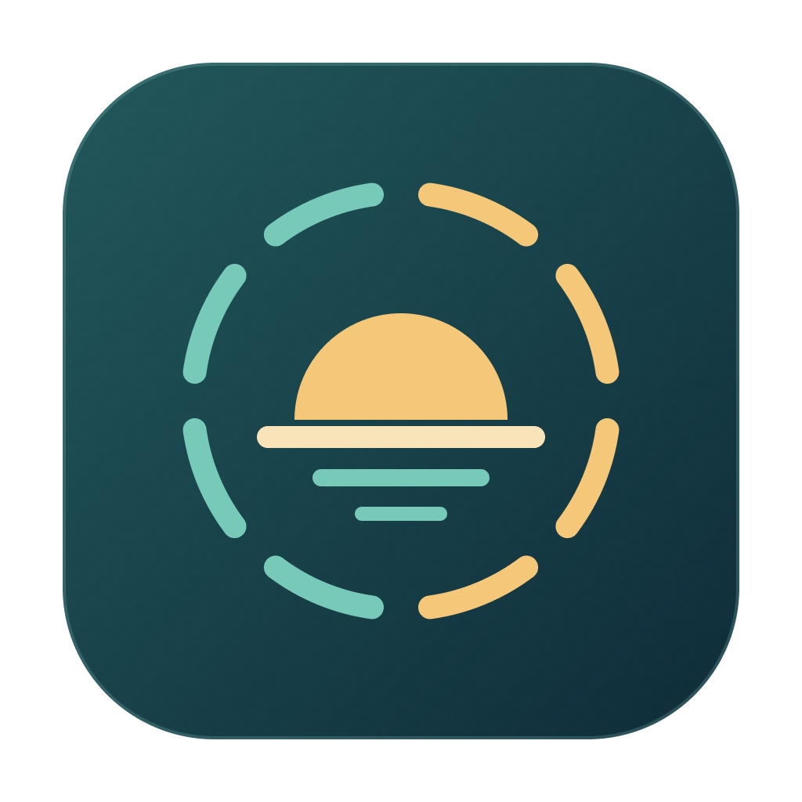
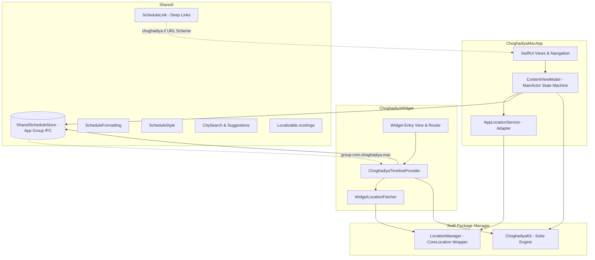

<p align="center">
  
  <h1 align="center">🕉️ Choghadiya for Mac</h1>
  <p align="center">
    <strong>Astronomical Vedic Choghadiya Dashboard & WidgetKit Suite for macOS</strong>
  </p>
  <p align="center">
    <a href="https://github.com/bhargavkukadiya/ChoghadiyaMac/releases/tag/1.0.0"></a>
    <a href="https://developer.apple.com/macos/"></a>
    <a href="https://swift.org"></a>
    <a href="https://github.com/yonaskolb/XcodeGen"></a>
    <a href="https://github.com/nicklockwood/SwiftFormat"></a>
    <a href="https://github.com/bhargavkukadiya/ChoghadiyaMac/actions/workflows/ci.yml"></a>
    <a href="LICENSE"></a>
  </p>
</p>

---

## Table of Contents

- [Overview](#overview)
- [Key Features](#key-features)
- [The Science of Vedic Choghadiya](#the-science-of-vedic-choghadiya)
- [WidgetKit Desktop & Notification Center Suite](#widgetkit-desktop--notification-center-suite)
- [Keyboard Shortcuts & macOS Integration](#keyboard-shortcuts--macos-integration)
- [Architecture & Tech Stack](#architecture--tech-stack)
- [Project Directory Structure](#project-directory-structure)
- [Getting Started & Building](#getting-started--building)
  - [Prerequisites](#prerequisites)
  - [Clone & Project Generation](#clone--project-generation)
  - [Build via Xcode or CLI](#build-via-xcode-or-cli)
  - [Helper Scripts](#helper-scripts)
- [Testing & Quality Assurance](#testing--quality-assurance)
- [App Sandbox & Privacy Guarantee](#app-sandbox--privacy-guarantee)
- [Localization](#localization)
- [Icon & Vector Assets](#icon--vector-assets)
- [Contributing](#contributing)
- [License & Acknowledgments](#license--acknowledgments)

---

## Overview

**Choghadiya for Mac** is a native macOS application and WidgetKit suite designed to calculate and present Vedic **Choghadiya** (auspicious and inauspicious planetary muhurthas) derived dynamically from real-time astronomical solar coordinates.

In Vedic chronometry (*Panchang*), time is non-linear and anchored strictly to the solar cycle. Each 24-hour day begins at local astronomical sunrise and is divided into 16 planetary hours (8 diurnal periods and 8 nocturnal periods), with lengths fluctuating depending on latitude, solar declination, and season.

Built from the ground up with **SwiftUI**, **Swift Concurrency**, **WidgetKit**, and **XcodeGen**, the app pairs modern Apple platform engineering with traditional Vedic astrological calculations.

---

## Key Features

- ☀️ **Astronomical Solar Precision:** Computes exact daily divisions based on precise geographical coordinates and astronomical sunrise/sunset calculations rather than arbitrary clock approximations.
- ⏱️ **Live Countdown & Active Hero Card:** Real-time second-by-second countdown with visual pulse indicator and qualitative color gradients matching the active planetary period.
- 🪐 **Planetary Graha Rulers:** Full visibility into ruling celestial deities (*Surya, Chandra, Mangal, Budha, Guru, Shukra, Shani*) and qualitative auspiciousness classifications.
- 🌓 **Diurnal & Nocturnal Views:** One-click segmented selector to switch between Day (8 periods) and Night (8 periods) schedules.
- 🖥️ **Desktop & Notification Center Widgets:**
  - **Small (`.systemSmall`):** Compact glanceable card displaying the active Choghadiya, qualitative badge, remaining countdown, and resolved city.
  - **Medium (`.systemMedium`):** Comprehensive side-by-side dashboard featuring the active period on the left and the next 3 upcoming slots on the right.
  - **Interactive AppIntents (macOS 14+):** Right-click any widget to configure a custom City and target Date directly within Notification Center.
  - **Seamless Deep Linking:** Clicking any widget instantly opens the host app focused on that specific city and date.
- 🔍 **Worldwide City Search & Timezones:** Full forward geocoding integration allowing instant lookups of any global city with localized civil day and timezone preservation.
- 🛡️ **Offline Resilience & Shared Storage:** High-performance App Group (`group.com.choghadiya.mac`) caching layer that keeps recent schedules visible offline until solar expiration.
- ⌨️ **Native macOS HIG Polish:** Full support for Dark & Light appearances, vibrancy materials, customizable sidebar, and comprehensive keyboard shortcuts.
- 🔒 **Sandboxed, with no analytics:** Schedules are stored locally. Solar-data requests send the selected location’s coordinates, date, and timezone to the Sunrise-Sunset API; city search and reverse geocoding use Apple services.

---

## The Science of Vedic Choghadiya

In Vedic astrology, each daytime period (sunrise to sunset) and nighttime period (sunset to the following sunrise) is partitioned into eight equal segments called *Choghadiyas* (literally meaning "four *ghadis*", approximately 96 minutes depending on daylight length). Each slot is governed by one of the seven classical celestial bodies (*Grahas*), producing specific qualities of time:

| Choghadiya | Vedic Meaning | Auspiciousness Tier | Ruling Graha (Planet) | Nature & Recommended Activities |
| :--- | :--- | :--- | :--- | :--- |
| **Amrit** | *Nectar* | ⭐ Highly Auspicious | Moon (*Chandra*) | Starting high-importance ventures, celebrations, religious rites, and medical treatments. |
| **Shubh** | *Auspicious* | 🟢 Auspicious | Jupiter (*Guru*) | Weddings, investments, education, religious ceremonies, and auspicious beginnings. |
| **Labh** | *Gain / Profit* | 🟢 Auspicious | Mercury (*Budha*) | Business negotiations, signing contracts, launching commercial enterprises, and new trades. |
| **Char (Chal)** | *Mobile / Fluid* | 🟡 Neutral / Moderate | Venus (*Shukra*) | Travel, dynamic tasks, shifting locations, transport, logistics, and vehicular movement. |
| **Udveg** | *Anxiety / Restlessness* | 🟠 Inauspicious | Sun (*Surya*) | Adverse for peaceful tasks; best used for routine or unavoidable work. Avoid new beginnings. |
| **Kaal** | *Destruction / Time* | 🔴 Inauspicious | Saturn (*Shani*) | Inauspicious for starting projects; suitable only for solitary, repetitive, or clearing work. |
| **Rog** | *Disease / Impediment* | 🔴 Avoid | Mars (*Mangal*) | High friction period; avoid disputes, financial trades, medical procedures, or auspicious events. |

> [!NOTE]
> The sequence of daytime and nighttime Choghadiyas rotates deterministically based on the ruling planet of the day (*Vāra*): Sunday (*Surya*), Monday (*Chandra*), Tuesday (*Mangal*), Wednesday (*Budha*), Thursday (*Guru*), Friday (*Shukra*), and Saturday (*Shani*).

---

## WidgetKit Desktop & Notification Center Suite

Choghadiya for Mac includes a complete WidgetKit extension designed for macOS Monterey, Ventura, Sonoma, and Sequoia:

```
┌──────────────────────────────────────┐     ┌────────────────────────────────────────────────────────────┐
│              SURAT                   │     │  SURAT                       NEXT UPCOMING                 │
│  ┌────────────────────────────────┐  │     │  ┌────────────────────────┐  ┌──────────────────────────┐  │
│  │             AMRIT              │  │     │  │         AMRIT          │  │ 10:45 AM  Kaal   (Sat)   │  │
│  │       Highly Auspicious        │  │     │  │   Highly Auspicious    │  │ 12:15 PM  Shubh  (Jup)   │  │
│  │           (Chandra)            │  │     │  │       (Chandra)        │  │ 01:45 PM  Rog    (Mar)   │  │
│  │                                │  │     │  │       01:24:18         │  └──────────────────────────┘  │
│  │            01:24:18            │  │     │  │     Expires 10:45 AM   │  Sunrise: 06:15 AM         │
│  │        Expires 10:45 AM        │  │     │  └────────────────────────┘  Sunset:  06:45 PM         │
│  └────────────────────────────────┘  │     │  Live Timings • Day Period   Fixed Date / Live Mode        │
└──────────────────────────────────────┘     └────────────────────────────────────────────────────────────┘
         SystemSmall Widget                                        SystemMedium Widget
```

### macOS 14+ Configurable AppIntents
- **City Configuration:** Right-click the widget and click **Edit Widget**. Select any custom searched city or leave as Default to mirror the app.
- **Fixed Date Inspection:** Choose a fixed calendar date to pin a daily solar summary and daytime schedule overview on your desktop.
- **Deep Linking:** Click any widget to trigger `choghadiya://schedule?city=...&date=...` and focus the app on that exact city and date.

---

## Keyboard Shortcuts & macOS Integration

Designed to feel immediately at home on macOS:

| Keyboard Shortcut | Menu Action | Description |
| :--- | :--- | :--- |
| <kbd>⌘</kbd> <kbd>L</kbd> | **Select City...** | Opens the global city picker sheet with search and suggestions. |
| <kbd>⌘</kbd> <kbd>R</kbd> | **Refresh Schedule** | Triggers an immediate refresh of solar calculations and time slots. |
| <kbd>⌘</kbd> <kbd>T</kbd> | **Jump to Today** | Instantly resets the calendar view to the live current day schedule. |
| <kbd>⌘</kbd> <kbd>,</kbd> | **Settings / Preferences** | Opens location permissions and app preferences. |
| <kbd>⌘</kbd> <kbd>W</kbd> | **Close Window** | Standard macOS window management. |
| <kbd>⌘</kbd> <kbd>Q</kbd> | **Quit Choghadiya** | Terminates the app cleanly. |

---

## Architecture & Tech Stack



- **Core Technologies:** SwiftUI, Swift 5.9 / 6.0 Concurrency (`async`/`await`, `@MainActor`, `TaskCancellation`), WidgetKit, Combine, App Group IPC.
- **External Packages:**
  - [ChoghadiyaKit](https://github.com/bhargavkukadiya/ChoghadiyaKit) (`v1.0.1`): Deterministic astronomical solar calculator and Panchang schedule builder.
  - [LocationManager](https://github.com/bhargavkukadiya/LocationManager) (`v1.0.1`): Production CoreLocation manager with native async/await, reverse geocoding, and stream safety.

For an exhaustive architectural deep dive, see [ARCHITECTURE.md](ARCHITECTURE.md).

---

## Project Directory Structure

```
ChoghadiyaMac/
├── project.yml                               # XcodeGen project specification
├── .swiftformat                              # Code formatting standards (4 spaces)
├── README.md                                 # Repository overview & documentation
├── ARCHITECTURE.md                           # Comprehensive architectural blueprint
├── CONTRIBUTING.md                           # Contributor guidelines & standards
├── SECURITY.md                               # Security policy & privacy disclosure
├── LICENSE                                   # MIT open-source license
│
├── App/                                      # Host macOS Application Target
│   ├── AppEntry/
│   │   └── ChoghadiyaApp.swift               # @main Application lifecycle
│   ├── ViewModels/
│   │   └── ContentViewModel.swift            # MainActor presentation state machine
│   ├── Views/
│   │   ├── ContentView.swift                 # Primary dashboard layout & navigation
│   │   └── Components/
│   │       ├── ActiveSlotHeroCard.swift      # Hero countdown card with live gradient
│   │       ├── SlotRowView.swift             # Interactive row for daytime/nighttime slot
│   │       ├── SelectedDateSummaryCard.swift # Solar sunrise/sunset summary card
│   │       ├── CityPickerSheet.swift         # Global city search & suggestion modal
│   │       └── LocationBannerView.swift      # Location authorization banner
│   ├── Services/
│   │   ├── LocationManaging.swift            # Location service protocol
│   │   └── AppLocationService.swift          # CoreLocation adapter
│   └── Resources/
│       ├── Assets.xcassets/                  # AppIcon vector assets
│       ├── App.entitlements                  # Sandbox & App Group entitlements
│       └── Info.plist                        # Bundle configuration & URL types
│
├── Shared/                                   # Shared Target Code (App & Widget)
│   ├── Assets.xcassets/                      # BrandMark, DayIcon, NightIcon
│   ├── CitySearch.swift                      # Forward geocoding & suggested cities
│   ├── ScheduleFormatting.swift              # Timezone-aware date/time formatting
│   ├── ScheduleLink.swift                    # Deep link builder & parser
│   ├── ScheduleStyle.swift                   # Color palettes & typography tokens
│   ├── SharedScheduleStore.swift             # App Group IPC persistence
│   └── Localizable.xcstrings                 # String catalog for localization
│
├── Widget/                                   # WidgetKit Extension Target
│   ├── WidgetEntry/
│   │   └── ChoghadiyaWidget.swift            # Widget bundle definition & configurations
│   ├── Provider/
│   │   └── ChoghadiyaTimelineProvider.swift  # Timeline provider & sunrise boundaries
│   ├── Configuration/
│   │   └── ScheduleWidgetIntent.swift        # AppIntent for macOS 14+ widget editing
│   ├── Views/
│   │   ├── ChoghadiyaWidgetEntryView.swift   # Responsive widget size router
│   │   ├── SmallWidgetView.swift             # .systemSmall compact layout
│   │   └── MediumWidgetView.swift            # .systemMedium side-by-side dashboard
│   ├── Services/
│   │   └── WidgetLocationFetcher.swift       # Async location coordinator for widgets
│   ├── Models/
│   │   └── SimpleEntry.swift                 # TimelineEntry model
│   ├── Theme/
│   │   └── WidgetTheme.swift                 # Widget-specific visual styles
│   └── Resources/
│       ├── Widget.entitlements               # Extension sandbox entitlements
│       └── Info.plist                        # Extension point declaration
│
├── Tests/                                    # Automated Test Suite (38+ tests)
│   ├── Mocks/
│   │   ├── MockLocationManager.swift         # Mock location double
│   │   └── ScheduleFixtures.swift            # Deterministic solar fixtures & TestClock
│   ├── ViewModels/
│   │   ├── ContentViewModelTests.swift       # State machine & interaction unit tests
│   │   └── ScheduleRegressionTests.swift     # Concurrency, date & cache regression tests
│   └── Integration/
│       ├── ChoghadiyaKitIntegrationTests.swift# Astronomical engine verification
│       ├── ScheduleFormattingTests.swift      # Timezone & civil day tests
│       ├── ScheduleLinkTests.swift            # Deep link round-trip serialization tests
│       ├── WidgetTimelineTests.swift          # Expiration & fallback timeline tests
│       └── WidgetRenderingTests.swift         # Light/Dark snapshot rendering tests
│
├── Design/                                   # Vector Design Assets
│   └── Icons/                                # Source SVGs, AppIcon.png & Figma link
│
└── script/                                   # Developer & CI Automation Scripts
    ├── build_and_run.sh                      # Build & launch unsigned debug binary
    ├── generate_app_icons.sh                 # Sips-based 10-size app icon generator
    └── install_and_reset.sh                  # Clean build, register & reset utility
```

---

## Getting Started & Building

### Prerequisites
- **Operating System:** macOS 12.0 (Monterey) or later (Configurable AppIntents require macOS 14+ Sonoma/Sequoia).
- **IDE:** Xcode 16.0+ with macOS SDK.
- **Project Generator:** [XcodeGen](https://github.com/yonaskolb/XcodeGen) 2.46+ (`brew install xcodegen`).
- **Code Formatter:** [SwiftFormat](https://github.com/nicklockwood/SwiftFormat) (`brew install swiftformat`).

### Clone & Project Generation
```bash
# 1. Clone the repository
git clone https://github.com/bhargavkukadiya/ChoghadiyaMac.git
cd ChoghadiyaMac

# 2. Generate the Xcode project from project.yml
xcodegen generate
```

### Build via Xcode or CLI
Open `ChoghadiyaMac.xcodeproj` in Xcode or run via terminal:
```bash
xcodebuild -project ChoghadiyaMac.xcodeproj \
           -scheme ChoghadiyaMacApp \
           -destination 'platform=macOS' \
           build CODE_SIGNING_ALLOWED=NO
```

### Download & Direct Installation
Download the latest disk image (`Choghadiya-1.0.0.dmg`) from the [GitHub Releases](https://github.com/bhargavkukadiya/ChoghadiyaMac/releases) page. Open the `.dmg` and drag **Choghadiya** to your **Applications** folder.

> [!TIP]
> **First Launch on macOS (Gatekeeper):**  
> Because this is a free open-source build without a paid Apple Developer ID certificate, macOS Gatekeeper may display an unidentified developer prompt on first launch. To open it:
> 1. Right-click (or <kbd>Control</kbd>-click) **Choghadiya.app** in Finder.
> 2. Click **Open**, then confirm by clicking **Open** in the dialog.
> 3. Alternatively, run: `xattr -cr /Applications/Choghadiya.app` in Terminal.

### Helper Scripts
- **Package Release Disk Image (.dmg):**
  ```bash
  ./script/create_dmg.sh             # Builds Release bundle and packages drag-and-drop .dmg
  ```
- **Launch Development App:**
  ```bash
  ./script/build_and_run.sh          # Build and open app
  ./script/build_and_run.sh --debug  # Launch with LLDB attached
  ./script/build_and_run.sh --logs   # Stream unified system logs
  ```
- **Regenerate App Icons:**
  ```bash
  ./script/generate_app_icons.sh     # Generates 10 macOS icon sizes from Design/Icons/AppIcon.png
  ```
- **Reset Development Environment:**
  ```bash
  ./script/install_and_reset.sh --reset-data # Clears App Group caches & restarts widget daemons
  ```

---

## Testing & Quality Assurance

The codebase includes an extensive automated test suite covering view model state transitions, concurrency safety, location fallbacks, solar calculations, and widget timelines:

```bash
xcodebuild test \
           -scheme ChoghadiyaMacApp \
           -destination 'platform=macOS' \
           CODE_SIGN_IDENTITY="" \
           CODE_SIGNING_REQUIRED=NO \
           CODE_SIGN_ENTITLEMENTS="" \
           CODE_SIGNING_ALLOWED=NO
```

**Test Coverage Summary (38 Tests):**
- ✅ `ScheduleRegressionTests` (15 tests): Rapid date changes, pre-sunrise rollover, fallback stability, and offline startup.
- ✅ `ContentViewModelTests` (6 tests): Initial state, authorization transitions, and date navigation.
- ✅ `ChoghadiyaKitIntegrationTests` (6 tests): Solar astronomical calculations and slot boundaries.
- ✅ `WidgetTimelineTests` (5 tests): Snapshot validation, expired cache rejection, and sunrise expiration.
- ✅ `ScheduleFormattingTests` (3 tests): Timezone fidelity and civil day formatting.
- ✅ `ScheduleLinkTests` (2 tests): Widget deep link serialization and error rejection.
- ✅ `WidgetRenderingTests` (1 test): SystemSmall and SystemMedium rendering in light and dark appearances.

---

## App Sandbox & Privacy Guarantee

- **Strict macOS Sandbox:** Both the host application and widget extension operate under full Apple sandbox policies.
- **Zero Tracking:** No analytics libraries, crash reporters, or third-party telemetry frameworks.
- **Location Transparency:** Device location is requested through CoreLocation with permission. Choosing a city manually avoids device-location access, but its coordinates are still used in network requests. City search and reverse geocoding use Apple services through LocationManager.
- **Solar API Disclosure:** ChoghadiyaKit sends latitude, longitude, date, and timezone to `api.sunrise-sunset.org` to fetch solar data. The app then computes the schedule and stores it locally for app/widget sharing. New schedules require network access; a valid cached schedule remains usable until it expires.

See [SECURITY.md](SECURITY.md) for our comprehensive security and privacy policy.

---

## Localization

Localization strings are managed in `Shared/Localizable.xcstrings`. The project has automated string extraction enabled in `project.yml`.

To contribute translations:
1. Open `Shared/Localizable.xcstrings` in Xcode.
2. Click **+** in the language sidebar to add your language (e.g. Hindi, Gujarati, Tamil, Marathi, French, German).
3. Translate the keys and submit a Pull Request.

---

## Icon & Vector Assets

The visual identity is custom-crafted for macOS:
- **Design Source:** [Figma Design File](https://www.figma.com/design/Cj38vuhwShEoc84x4VF0o6)
- **Symbolism:** The sunrise arc and eight dial segments depict the eight diurnal periods of the Vedic day.
- **Asset Specifications:** See [Design/Icons/README.md](Design/Icons/README.md).

---

## Contributing

Contributions are welcomed! Please see [CONTRIBUTING.md](CONTRIBUTING.md) for development workflows, coding standards, and pull request guidelines.

---

## License & Acknowledgments

This project is licensed under the **MIT License** — see the [LICENSE](LICENSE) file for details.

- **Astronomical Calculations:** Powered by [ChoghadiyaKit](https://github.com/bhargavkukadiya/ChoghadiyaKit).
- **CoreLocation Engine:** Powered by [LocationManager](https://github.com/bhargavkukadiya/LocationManager).
- **Solar Data API:** [Sunrise-Sunset.org](https://sunrise-sunset.org).
